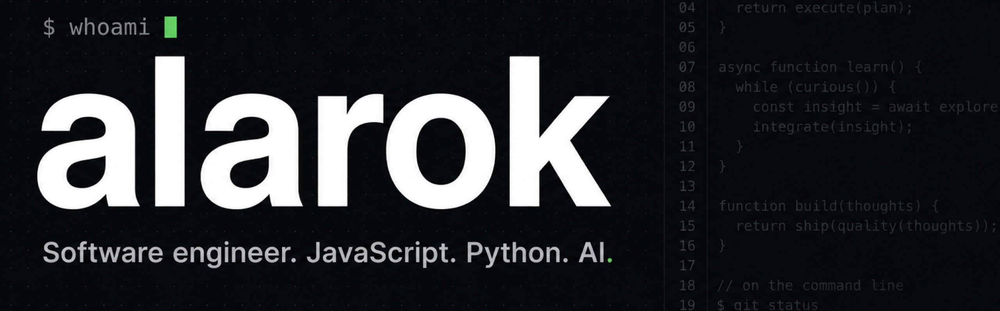

  

Software engineer. I write JavaScript and Python for a living, and I keep doing it in my free time, which I have mixed feelings about.

I like tools I don't have to think about. Current rotation: bun, Hono, Tailwind.

  
  
  
  
  

**Languages:** TypeScript, JavaScript, Python, SQL (more than I like to admit).

**Currently:** working as a software engineer. There's a side project that keeps growing and I keep telling myself it's almost done.

Some repos here are experiments that got out of hand. The rest are ones I actually ship. Both are usually functional.
